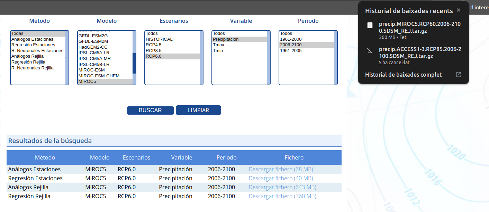

# DOCUMENTACION DE LA PRACTICA TA06
_Hecho por Manuel Amaya, Rodrigo Montoya, Abel Aymami y Diego Cornelles_

## Ejercicio 1:
Primero de todo debíamos de **obtener los datos**, para ello debíamos entrar en AEMET (Agencia Estatal de Meteorología) para descargarnos los datos. Pero para poder descargarlos debíamos de conseguir la API-key, para ello buscamos obtención de api-key AEMET en el buscador y la primera opción será el enlace en el que la podremos obtener, entramos y rellenamos el formulario:

Ahora, una vez obtenido la API-key, entramos a la página de AEMET por el enlace directo que nos ofreció el profesor, pegamos la API-key y buscamos el que era el archivo correcto a descargar:

Luego se deberán de subir los datos al PyCharm para poder procesarlas y organizarlas.

## Ejercicio 2
Una vez obtenidos los datos, deberemos de organizarlos y procesarlos. Para ello utilizamos la aplicación de PyCharm y con el apoyo de Copilot, en la que crearemos un archivo y utilizaremos el lenguaje Python.

Para ello el código debe de poder leer los ficheros; saber que estén delimitados a los datos especificados (Espacios, comas, separar cabecera de los datos, que todos los archivos tengan el mismo formato y asegurando que no tengan ningún error, según los delimitadores especificados. 

Después hay que calcular el porcentaje de datos que faltan (-999), las estadisticas de los datos procesados:

- **Medianas totales y anuales**
- **Tendencia de cambio**
- **Extremos (Años con mas y menos precipitaciones)**

 Ademas habrá que analizar los datos, de manera que tengamos que pensar que estadisticas podemos hacer.

## Ejercicio 3
