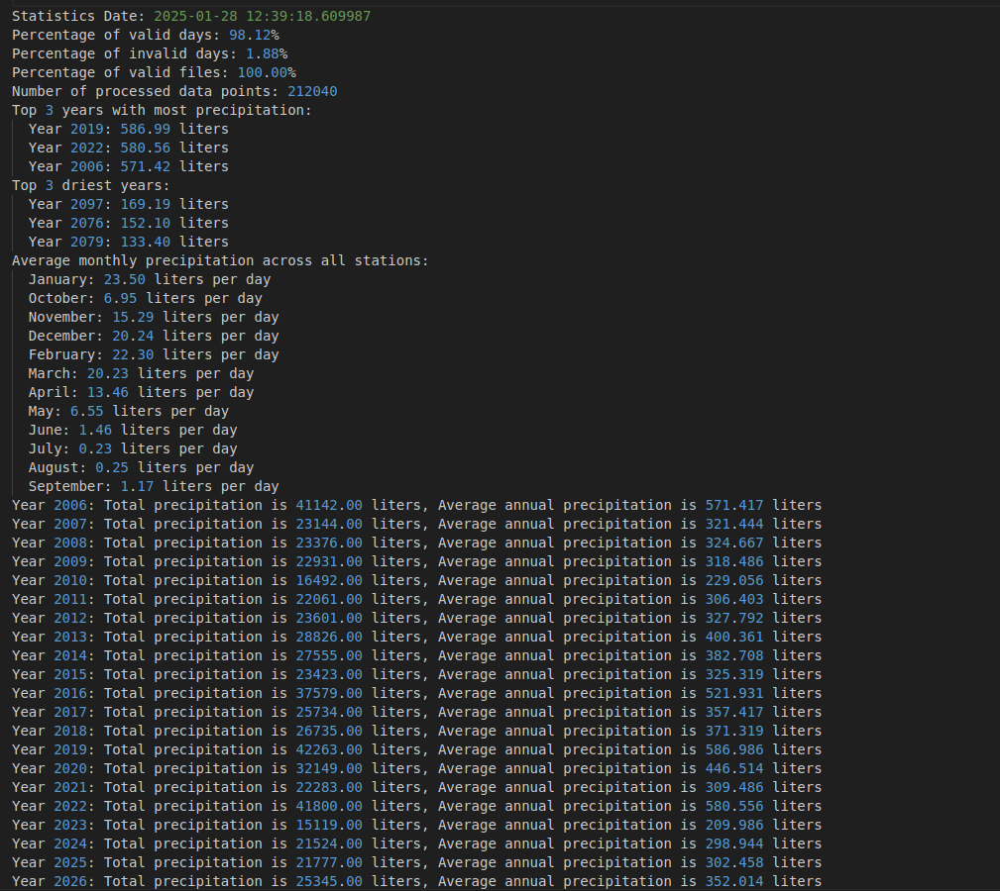
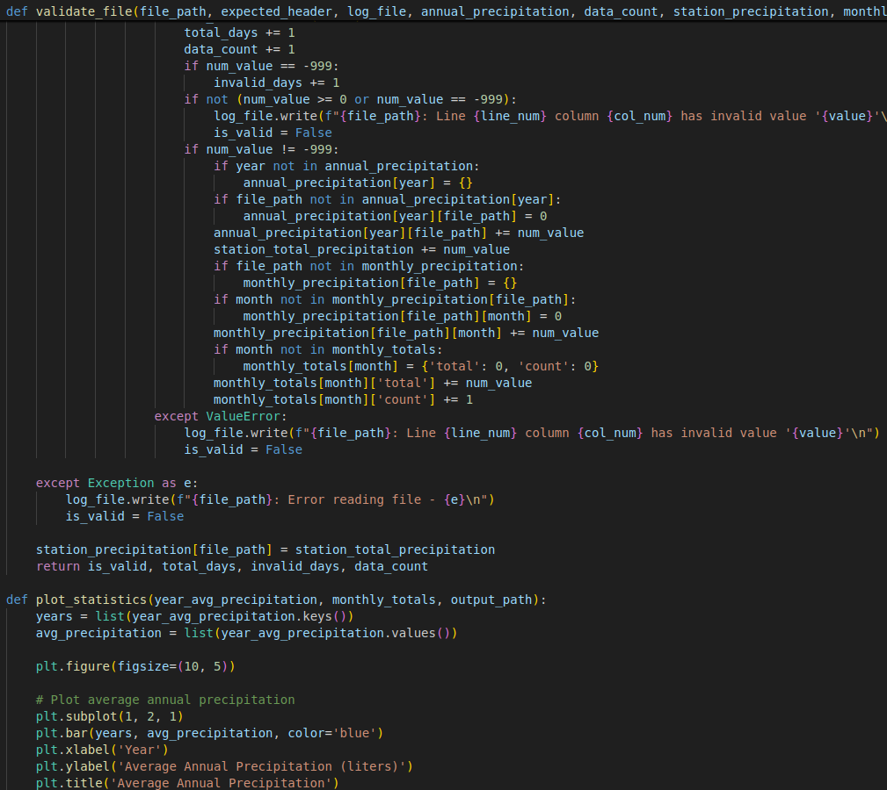

# DOCUMENTACIÓN DE LA PRÁCTICA TA06
_Hecho por Manuel Amaya, Rodrigo Montoya, Abel Aymami y Diego Cornelles_

## Clica en uno de los enlaces para ir al EJERCICIO que necesites

- [**Ejercicio 1**](#Ejercicio-1)
- [**Ejercicio 2**](#Ejercicio-2)
- [**Ejercicio 3**](#Ejercicio-3)
- [**Ejercicio 4**](#Ejercicio-4)
- [**Ejercicio 5**](#Ejercicio-5)

---

# Ejercicio 1:
Primero de todo debíamos de **obtener los datos**, para ello debíamos entrar en AEMET (Agencia Estatal de Meteorología) para descargarnos los datos. Pero para poder descargarlos debíamos de conseguir la API-key, para ello buscamos "obtención de API-key AEMET" en el buscador y la primera opción será el enlace en el que la podremos obtener, entramos y rellenamos el formulario:

Una vez obtenida la API-key, entramos a la página de AEMET por el enlace directo que nos ofreció el profesor, pegamos la API-key y buscamos el archivo correcto a descargar:

Luego se deberán de subir los datos a PyCharm para poder procesarlas y organizarlas.

---

# Ejercicio 2:
[**Volver al principio**](#documentación-de-la-práctica-ta06)

Una vez obtenidos los datos, debemos organizarlos y procesarlos. Para ello utilizamos la aplicación PyCharm y con el apoyo de Copilot, en la que creamos un archivo y utilizamos el lenguaje Python.

El código debe poder leer los ficheros, asegurándose de que estén delimitados según los datos especificados (espacios, comas), separar cabeceras de los datos y asegurarse de que todos los archivos tengan el mismo formato y no contengan errores según los delimitadores especificados.

Después, hay que calcular el porcentaje de datos que faltan (-999) y calcular las estadísticas de los datos procesados:

- **Medianas totales y anuales**
- **Tendencia de cambio**
- **Extremos (Años con más y menos precipitaciones)**

Todos los datos deben ser extraídos, por lo tanto, hay que crear un fichero log para poder ver las estadísticas que se piden.

Además, habrá que analizar los datos, de manera que tengamos que pensar qué estadísticas podemos obtener.

Para obtener todas las estadísticas necesarias, necesitaremos un script:

A veces, los códigos o los datos pueden tener errores, por lo tanto, es importante tener un fichero de errores que indique qué fallos existen.

---

# Ejercicio 3:
[**Volver al principio**](#documentación-de-la-práctica-ta06)

Una vez hemos obtenido todos los datos necesarios, hay que crear resúmenes estadísticos y gráficos estadísticos, para que sea mucho más fácil de entender.

Después, hay que exportar esos resúmenes estadísticos a un fichero CSV.

---

# Ejercicio 4:
[**Volver al principio**](#documentación-de-la-práctica-ta06)

Ahora que ya tenemos los datos necesarios, necesitamos publicarlos y para eso utilizaremos una página web.

---

# Ejercicio 5:
[**Volver al principio**](#documentación-de-la-práctica-ta06)

En este ejercicio, se busca mejorar la presentación visual de los datos. Se podría, por ejemplo, agregar algún estilo a los elementos visuales como títulos, botones o gráficos en la página web de visualización de datos para hacerla más atractiva o fácil de entender.

---
